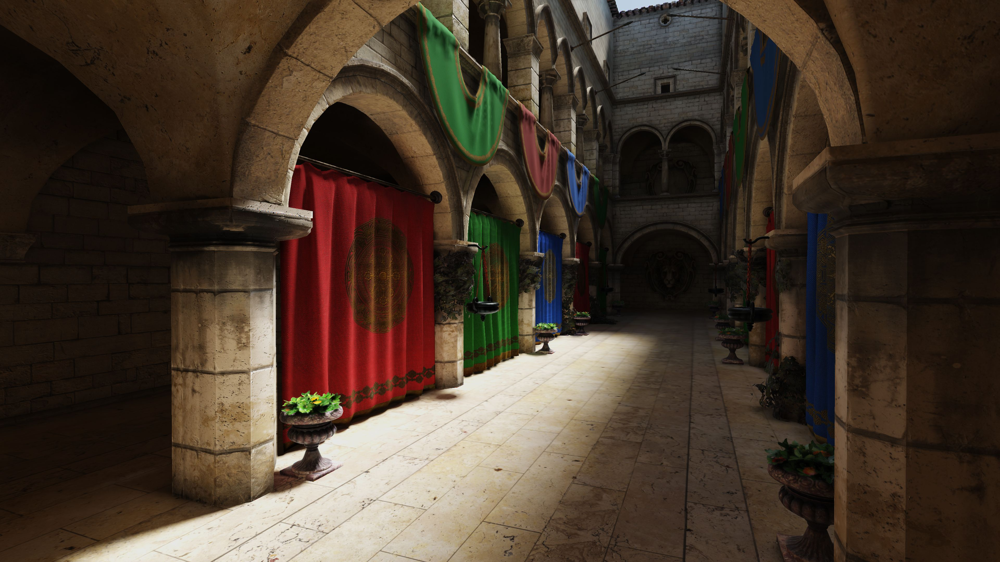
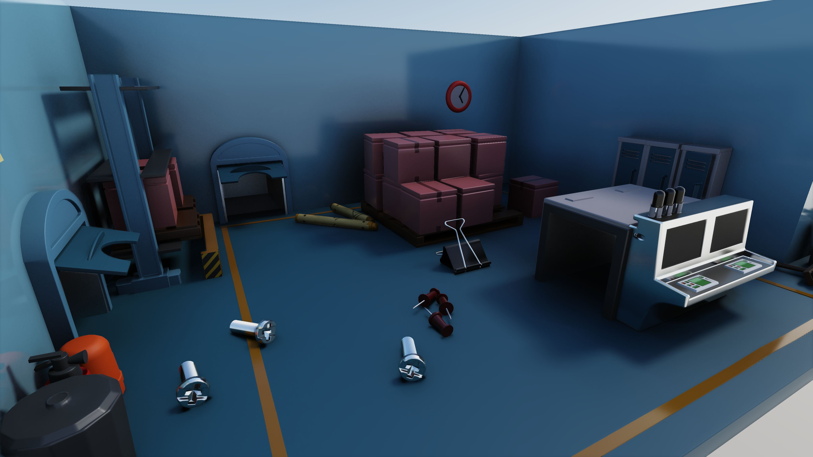
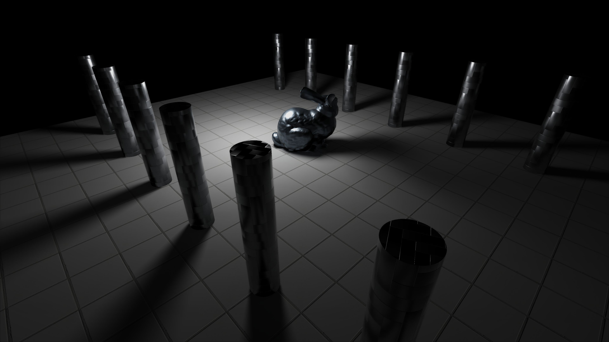
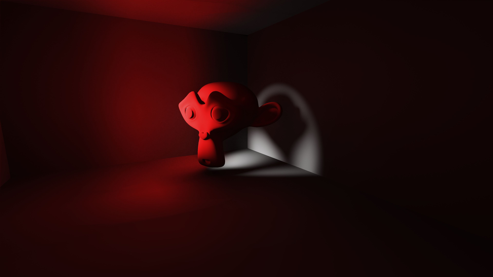

#  Hybrid Rendering

A Vulkan sample that demonstrates an integration of Ray Traced Shadows, Ambient Occlusion, Reflections and Global Illumination into a Deferred Rendering Pipeline.

## Screenshots










## Usage

1. Download the latest release here.
2. Extract archive contents.
3. Run HybridRendering.exe.

### Controls

* `W`/`A`/`S`/`D` - camera movement.
* `RMB` - hold to look around.
* `G` - toggle UI.
* `ESC` - close application.

## Building

### Windows
Tested on: Windows 10 version 21H1

Prerequisites
* MSVC 19.00 or higher
* CMake 3.8 or higher
* Vulkan SDK 1.2.189.2 or higher

```
git clone --recursive https://github.com/diharaw/HybridRendering.git
cd HybridRendering
mkdir build
cd HybridRendering
cmake -G "Visual Studio 16 2019" ..
```
Note: To obtain the assets please download the release and copy the *meshes* and *textures* into the folder containing the built executable.

## System Requirements

A GPU that supports the following Vulkan Extensions:

* VK_KHR_ray_tracing_pipeline
* VK_KHR_acceleration_structure
* VK_EXT_descriptor_indexing

Requires the latest NVIDIA/AMD drivers.

## Dependencies
* [dwSampleFramework](https://github.com/diharaw/dwSampleFramework) 
* [ImGuizmo](https://github.com/CedricGuillemet/ImGuizmo)

## License
```
Copyright (c) 2021 Dihara Wijetunga

Permission is hereby granted, free of charge, to any person obtaining a copy of this software and 
associated documentation files (the "Software"), to deal in the Software without restriction, 
including without limitation the rights to use, copy, modify, merge, publish, distribute, sublicense,
and/or sell copies of the Software, and to permit persons to whom the Software is furnished to do so, 
subject to the following conditions:

The above copyright notice and this permission notice shall be included in all copies or substantial
portions of the Software.

THE SOFTWARE IS PROVIDED "AS IS", WITHOUT WARRANTY OF ANY KIND, EXPRESS OR IMPLIED, INCLUDING BUT NOT 
LIMITED TO THE WARRANTIES OF MERCHANTABILITY, FITNESS FOR A PARTICULAR PURPOSE AND NONINFRINGEMENT. 
IN NO EVENT SHALL THE AUTHORS OR COPYRIGHT HOLDERS BE LIABLE FOR ANY CLAIM, DAMAGES OR OTHER LIABILITY,
WHETHER IN AN ACTION OF CONTRACT, TORT OR OTHERWISE, ARISING FROM, OUT OF OR IN CONNECTION WITH THE 
SOFTWARE OR THE USE OR OTHER DEALINGS IN THE SOFTWARE.
```